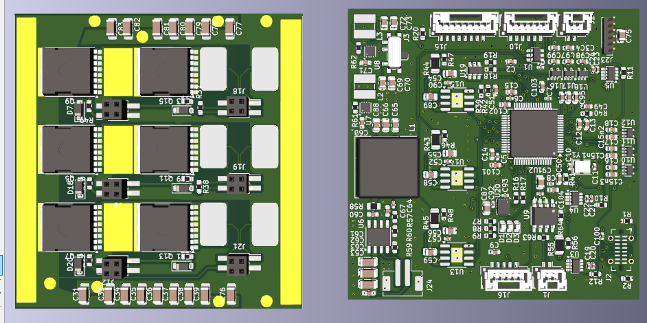

# Baguette-ESC – Experimental Compact ESC Based on VESC

**OpenESC** is an open-source, compact Electronic Speed Controller (ESC) inspired by the VESC platform. It is designed to push boundaries in high-voltage motor control and explore innovative hardware concepts.  
⚠️ **Please note: this project is in a very early stage and has not yet been tested.** Use at your own risk.

---
## ❗ Liability Warning

⚠️ THIS PROJECT IS PROVIDED "AS IS", WITHOUT ANY EXPRESS OR IMPLIED WARRANTY.
I AM NOT RESPONSIBLE FOR ANY DAMAGE TO PERSONS, PROPERTY, OR EQUIPMENT RESULTING FROM THE USE, MISUSE, OR MALFUNCTION OF THIS HARDWARE OR SOFTWARE.

BY USING ANY PART OF THIS PROJECT, YOU AGREE TO ASSUME ALL RISK AND LIABILITY.

---

## 🚧 Project Status: Experimental & Untested

This ESC design has **not been tested** in hardware yet. Schematics, PCB layouts, and component choices are experimental and may contain errors.  
**Do not use this design in safety-critical or commercial applications.** Community feedback and contributions are welcome to bring it closer to working prototype status.

---

## 🔧 Key Features

- **120V Toll MOSFETs** – For exploring high-voltage BLDC control
- **Compact Dual-Board Aluminum PCB Powerstage** – Designed for heat dissipation in a minimal footprint
- **Phase Filters** – Included to reduce switching noise and improve signal integrity
- **BMI160 IMU** – Onboard sensor for potential inertial feedback and experimentation
- **Expansion Port for Bluetooth Module** – Optional wireless connectivity for future development



---

## 📁 Repository Structure

- `/hardware` – Schematics, PCB layout (KiCad), BOM, and Gerbers
- `/firmware` – Configuration files for VESC firmware compatibility (WIP)
- `/docs` – Additional notes, board assembly info, and future test logs

---

## 🧪 Goals

- Explore high-voltage ESC design with open documentation
- Keep the design compact while pushing thermal and electrical limits
- Provide a foundation for collaborative experimentation and learning

---

## 📥 Getting Started

1. **Clone the Repository**

   ```bash
   git clone https://github.com/LJBoxx/Baguette-esc.git
   cd Baguette-esc
   ```

2. **Review the Design Files**
   - Hardware located in `/hardware`
   - Firmware is not yet customized; expected to work with stock VESC firmware (further testing required)

3. **⚠️ Warning Before Building**
   - This design is **completely untested**
   Electrical, thermal, and functional characteristics are unverified
   - Proceed only if you're comfortable debugging hardware issues

---

## 📜 License

This project is licensed under the **CERN Open Hardware Licence Version 2 - Strongly Reciprocal (CERN-OHL-S)**.

> If you distribute modified versions or hardware based on this project, you must also share your changes under the same license.

See the [LICENSE](./LICENSE) file for full legal text.

---

## 🙏 Acknowledgements

Special thanks to [Benjamin Vedder](https://vesc-project.com/) and the entire VESC community for laying the foundation for open-source motor control.

---

## 🤝 Contributing

Contributions, reviews, and test results are *very* welcome. Open an issue or submit a pull request to help move the project forward.

---

**⚡ Hack carefully. Test responsibly. Share openly.**
